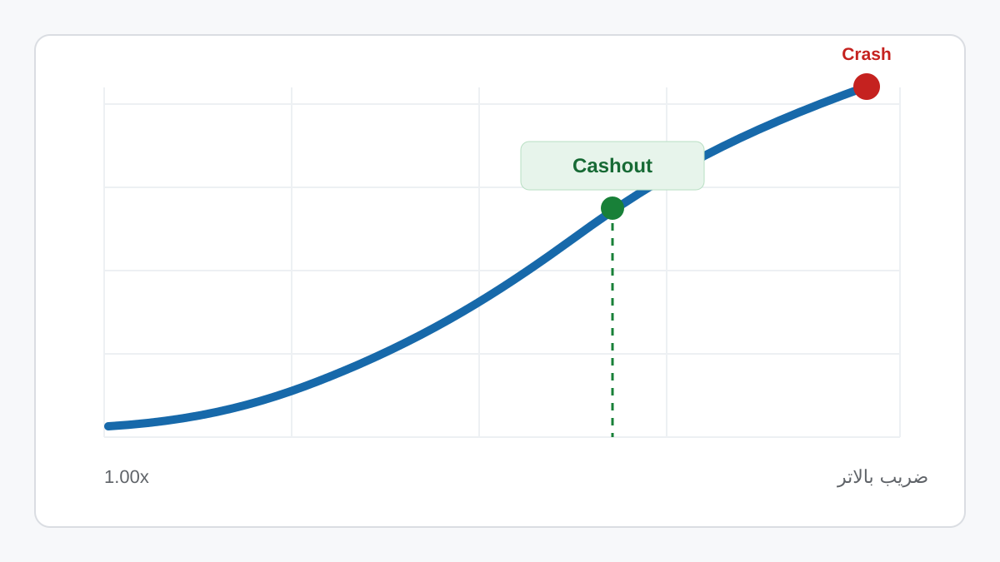

# بازی انفجار

راهنمای فارسی **بازی انفجار** با تمرکز بر نحوه کار ضریب، Cashout، الگوریتم بازی، تاریخچه ضرایب، Provably Fair، مدیریت سرمایه و بررسی ادعاهای مربوط به ربات و هک بازی انفجار.

**وب سایت اصلی:**  
[https://enfejarbazi.github.io/](https://enfejarbazi.github.io/)

**دانلود بازی انفجار برای اندروید:**  
[دانلود مستقیم bazi-enfejar.apk](https://enfejarbazi.github.io/bazi-enfejar.apk)

---

<p align="center">
  <a href="https://enfejarbazi.github.io/">
    
  </a>
</p>

## بازی انفجار چیست

بازی انفجار یا Crash Game یک بازی ضریب محور است. هر راند از یک ضریب اولیه شروع می‌شود و ضریب تا نقطه پایان همان راند افزایش پیدا می‌کند.

بازیکن می‌تواند پیش از پایان راند **Cashout** کند. اگر برداشت با موفقیت قبل از Crash ثبت شود، مبلغ بازگشتی بر اساس مبلغ شرط و ضریب خروج محاسبه می‌شود. اگر Crash زودتر رخ دهد، مبلغ همان شرط از دست می‌رود.

برای مثال، اگر مبلغ شرط 100 هزار تومان باشد و Cashout در ضریب 2.10x انجام شود، مبلغ بازگشتی 210 هزار تومان خواهد بود.

> این مثال فقط نحوه محاسبه مبلغ را توضیح می‌دهد و نتیجه یا ضریب راند بعدی را پیش‌بینی نمی‌کند.

## آموزش بازی انفجار

راهنمای اصلی سایت مراحل بازی را از ابتدا توضیح می‌دهد:

1. تعیین مبلغ هر شرط
2. انتخاب Cashout دستی یا Auto Cashout
3. شروع افزایش ضریب
4. ثبت Cashout پیش از Crash
5. محاسبه مبلغ بازگشتی
6. بررسی تاریخچه راندها
7. مدیریت مبلغ هر شرط نسبت به Bankroll

[آموزش کامل بازی انفجار](https://enfejarbazi.github.io/#how)

## محاسبه ضریب و Cashout

در صفحه اصلی یک محاسبه‌گر اختصاصی وجود دارد که با وارد کردن:

- کل بودجه
- مبلغ شرط
- ضریب Cashout
- ضریب Crash فرضی

مبلغ بازگشتی، سود یا زیان همان سناریو و درصد بودجه درگیر را محاسبه می‌کند.

[محاسبه سود و زیان بازی انفجار](https://enfejarbazi.github.io/#calculator)

## الگوریتم بازی انفجار

تمام بازی‌های انفجار الزاماً از یک الگوریتم یکسان استفاده نمی‌کنند. ساختار تولید نتیجه می‌تواند میان ارائه‌دهندگان متفاوت باشد.

در بعضی سیستم‌ها داده‌هایی مانند موارد زیر در سازوکار Provably Fair استفاده می‌شوند:

- Server Seed
- Client Seed
- Nonce
- Hash
- Commitment
- Verify

به همین دلیل نمی‌توان یک فرمول ثابت MD5 یا Hash را به تمام نسخه‌های بازی انفجار نسبت داد.

[توضیح الگوریتم بازی انفجار](https://enfejarbazi.github.io/#algorithm)

## Provably Fair در بازی انفجار

Provably Fair برای **راستی‌آزمایی نتیجه** طراحی شده است، نه برای نمایش نتیجه آینده.

یک پیاده‌سازی قابل بررسی باید مشخص کند:

- چه داده‌ای قبل از راند Commit می‌شود
- چه داده‌هایی پس از راند منتشر می‌شوند
- الگوریتم Verify چیست
- نتیجه چگونه از داده‌ها محاسبه می‌شود
- آیا کاربر می‌تواند بررسی را مستقل تکرار کند

[راهنمای Provably Fair](https://enfejarbazi.github.io/#fair)

## هک و ربات بازی انفجار

در اینترنت ادعاهایی درباره ربات پیش‌بینی ضریب، هک بازی انفجار و نرم‌افزار تشخیص ضریب دیده می‌شود.

یک نکته فنی مهم این است که **Verify کردن نتیجه گذشته با Prediction نتیجه آینده یکسان نیست**.

ابزاری که بعد از پایان راند بتواند نتیجه را با Seed یا Hash بررسی کند، لزوماً هیچ اطلاعاتی درباره نتیجه راند بعدی ندارد.

[بررسی هک و ربات بازی انفجار](https://enfejarbazi.github.io/#hack)

## تاریخچه ضرایب بازی انفجار

History معمولاً نتایج راندهای قبلی را نمایش می‌دهد. تاریخچه برای مشاهده و بررسی راندهای انجام‌شده مفید است، اما مشاهده چند ضریب قبلی به تنهایی نتیجه راند آینده را تعیین نمی‌کند.

[توضیح تاریخچه بازی انفجار](https://enfejarbazi.github.io/#history)

## مدیریت سرمایه

مدیریت سرمایه نتیجه بازی را تغییر نمی‌دهد، اما مشخص می‌کند چه مقدار از موجودی در هر راند در معرض ریسک قرار گرفته است.

در راهنمای اصلی، نمونه‌های عددی برای مقایسه اندازه شرط با Bankroll و همچنین رشد سریع مبلغ در روش‌هایی مانند Martingale وجود دارد.

[مدیریت سرمایه در بازی انفجار](https://enfejarbazi.github.io/#bankroll)

## دانلود بازی انفجار

نسخه APK موجود در این مخزن با نام زیر ذخیره شده است:

```text
bazi-enfejar.apk
```

### دانلود مستقیم

**از سایت:**

[https://enfejarbazi.github.io/bazi-enfejar.apk](https://enfejarbazi.github.io/bazi-enfejar.apk)

**از GitHub:**

[دانلود APK از GitHub](https://github.com/enfejarbazi/enfejarbazi.github.io/raw/refs/heads/main/bazi-enfejar.apk)

### اطلاعات فایل

| مشخصات | مقدار |
|---|---|
| نام فایل | `bazi-enfejar.apk` |
| حجم | `7.21 MB` |
| SHA-256 | `e28fc5fd06e59bf9a53c3128494dcad91a6d0749a0dc9089f94edca2c29944af` |
| تاریخ ثبت در مخزن | `2026-10-02` |
| منبع فایل | `https://sibdlapp.buzz/sibbet-app.apk?v6` |

SHA-256 به کاربران اجازه می‌دهد فایل دانلودشده را با نسخه قرارگرفته در این مخزن مقایسه کنند.

## بررسی سایت بازی انفجار

قبل از ورود اطلاعات یا انجام پرداخت بهتر است موارد زیر بررسی شوند:

- آدرس کامل دامنه
- پسوند دامنه
- HTTPS
- شرایط واریز و برداشت
- قوانین بونوس
- منبع فایل APK
- مجوزهای برنامه اندروید
- ادعاهای مربوط به مجوز یا اعتبار سرویس
- تفاوت دامنه اصلی با دامنه‌های مشابه

[چک لیست بررسی سایت بازی انفجار](https://enfejarbazi.github.io/#site-check)

## محتوای این پروژه

این پروژه روی یک موضوع مشخص تمرکز دارد و بخش‌های اصلی راهنما شامل متن، تصاویر محلی، مثال‌های عددی و ابزار محاسبه است.

در بخش‌های فنی، ادعاهایی که به پیاده‌سازی یک ارائه‌دهنده خاص وابسته هستند به تمام بازی‌های انفجار تعمیم داده نشده‌اند. همچنین اطلاعات متغیر مانند درصد بونوس، حداقل واریز یا زمان قطعی برداشت به عنوان عدد ثابت معرفی نشده است.

آخرین بازبینی: **2026-10-02**

## نویسنده

<table>
<tr>
<td width="110">

</td>
<td>

### سروش امینی

نویسنده این راهنما با تمرکز بر توضیح ساده بازی‌های ضریب محور، Cashout، مدیریت ریسک و بررسی ادعاهای فنی مرتبط با بازی‌های آنلاین.

[مشاهده راهنمای اصلی بازی انفجار](https://enfejarbazi.github.io/)

</td>
</tr>
</table>

## لینک‌های اصلی

- [بازی انفجار](https://enfejarbazi.github.io/)
- [آموزش بازی انفجار](https://enfejarbazi.github.io/#how)
- [محاسبه ضریب و Cashout](https://enfejarbazi.github.io/#calculator)
- [الگوریتم بازی انفجار](https://enfejarbazi.github.io/#algorithm)
- [Provably Fair](https://enfejarbazi.github.io/#fair)
- [هک و ربات بازی انفجار](https://enfejarbazi.github.io/#hack)
- [تاریخچه ضرایب](https://enfejarbazi.github.io/#history)
- [مدیریت سرمایه](https://enfejarbazi.github.io/#bankroll)
- [دانلود بازی انفجار](https://enfejarbazi.github.io/bazi-enfejar.apk)

---

**بازی انفجار | Crash Game | Cashout | الگوریتم بازی انفجار | Provably Fair**
